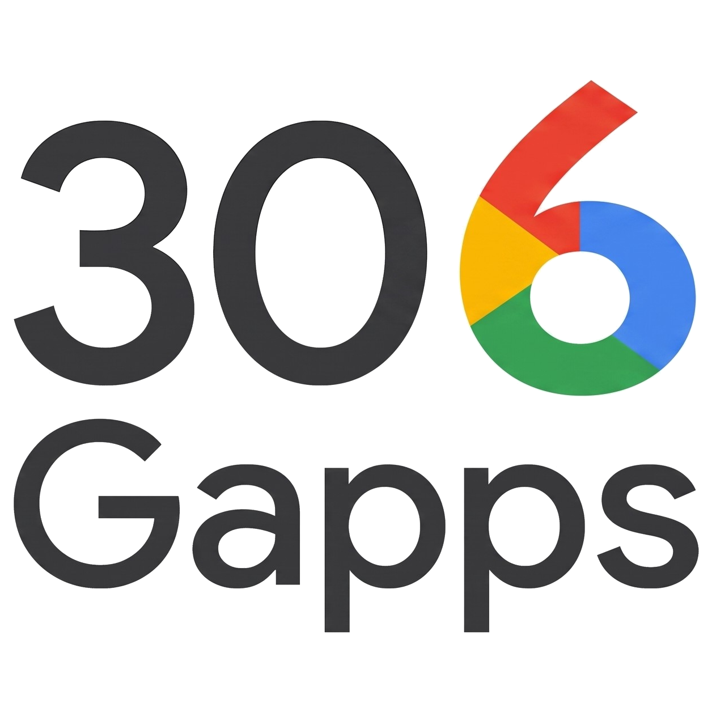

# 306gapps

Builds a flashable Google apps package for a custom ROM. Pick an Android
release, pick the apps you want, get a zip.

The apps come from Google's Pixel OTA images. This tool downloads only the
packages you selected, checks each one against its published digest, and
assembles the package on your machine. Nothing is built on a server, and no
account is needed.

## Download

Grab a binary from [releases](https://github.com/306gapps/306gapps/releases).

| you are on | file |
| --- | --- |
| Linux, normal PC | `306gapps-<version>-linux-amd64` |
| Linux, ARM | `306gapps-<version>-linux-arm64` |
| Windows, normal PC | `306gapps-<version>-windows-amd64.exe` |
| Windows, ARM | `306gapps-<version>-windows-arm64.exe` |
| macOS, Apple Silicon | `306gapps-<version>-darwin-arm64` |
| macOS, Intel | `306gapps-<version>-darwin-amd64` |
| Android phone | `306gapps-<version>-android-arm64.apk` |

`SHA256SUMS` is there if you want to check the download.

On Linux and macOS you will need to mark it executable:

```
chmod +x 306gapps-*
```

**Linux and Windows** builds have both a window-based picker and a terminal
one. **macOS** builds are terminal only. The Linux window picker needs glibc
2.34 or newer, which means Ubuntu 22.04+, Debian 12+, Fedora 35+ or similar;
the terminal picker works anywhere.

**Android** builds recovery zips only, no module or OTA target yet. Install
the apk, pick a release and apps, tap Build, then save the zip somewhere your
recovery can read. The build keeps going if you leave the app; a notification
shows progress. Android 9 or newer, 64-bit ARM.

## Getting a package

Run it with no arguments and it opens the picker:

```
306gapps
```

You get a window if your machine has a desktop, and the terminal picker if it
does not. To force one or the other:

```
306gapps gui      window picker
306gapps pick     terminal picker
```

On Linux the window picker adds a menu entry the first time it runs, which is
what gives it a name and an icon in your launcher and taskbar. Move the binary
and run `306gapps install-desktop` to point the entry at its new home.

Pick an Android release, tick the apps you want, choose a format, and it builds
the zip. Flash that in recovery.

### Picking apps

Apps are grouped into families. Ticking one app may pull in others it needs, and
the picker shows you when that happens rather than surprising you later. Some
apps cannot be turned off because everything else depends on them.

There are presets if you do not want to choose individually:

| preset | what you get |
| --- | --- |
| `core` | Play services, Play Store, the framework. The minimum that signs in and installs apps. |
| `basic` | core plus phone, messages, contacts, clock, carrier services |
| `omni` | basic plus setup, keyboard, and the everyday Google apps |
| `stock` | roughly what a Pixel ships with |
| `full` | stock plus the rest |
| `everything` | every package in the release |

### The terminal picker

`306gapps pick` walks through four screens: release, apps, format, build.

```
a17-cd1a.260905.001.b1 · Android 17

  CORE
> [■] gmscore                230.8 MB  Google Play services
  [■] gsf                      1.1 MB  Google Services Framework
  [x] vending                 99.1 MB  Google Play Store
  [ ] verifier                 3.0 MB  Play Protect verifier
  [·] syncadapters             3.9 MB  Contacts and Calendar sync adapters

  SETUP WIZARD
  [x] setupwizard             26.5 MB  Google Setup Wizard

6 packages · 337.8 MB installed
[·] 1 pulled in as dependencies
space toggle · a all in section · n none · r reset · enter continue · q quit
```

| box | meaning |
| --- | --- |
| `[ ]` | not selected |
| `[x]` | selected |
| `[■]` | required, cannot be turned off |
| `[·]` | you did not tick this, something you did tick needs it |

| key | action |
| --- | --- |
| `↑` `↓` or `k` `j` | move |
| `space` or `x` | tick or untick |
| `a` | tick everything in this family |
| `n` | untick everything in this family |
| `r` | back to the defaults |
| `enter` | next screen |
| `esc` | previous screen |
| `q` or `ctrl+c` | quit |

The totals at the bottom are what will actually be installed, including anything
pulled in as a dependency. If you pick two apps that cannot coexist, it says so
in red and will not let you continue until you fix it.

## Which format?

**Recovery zip** is what most people want. Flash it in TWRP or LineageOS
recovery. No root needed. It installs into the ROM, removes the AOSP apps your
selection replaces, wipes the dalvik cache, and installs an `addon.d` script so
your apps survive dirty-flashing the ROM later. It refuses to install if the
package does not match your ROM's Android version.

**Magisk / KernelSU module** needs root. Nothing is written into the ROM; the
files are overlaid on top, so turning the module off puts the phone back exactly
as it was. It also survives OTA updates. Safer, if you have root.

**OTA** is for people who build and sign their own ROM. See below.

## Without the picker

```
306gapps build -release 17 -variant stock -target recovery -out gapps.zip
306gapps build -packages gsa,photos,gboard -target module
306gapps list                available releases
306gapps list 17             what is in the newest Android 17 release
306gapps install-desktop     Linux: refresh the menu entry and icon
```

| flag | meaning |
| --- | --- |
| `-release` | Android version (`17`), release ID, or `latest` |
| `-variant` | one of the presets above |
| `-packages` | comma-separated app IDs, added to `-variant` if you give both |
| `-target` | `recovery`, `module`, or `ota` |
| `-out` | where to write the zip |
| `-no-sign` | skip signing |

Flags go before any other argument.

## Undoing an install

```
306gapps uninstaller
```

That zip removes anything this tool has installed. It is not tied to a release,
so one copy works for any package you have built.

It does not put back the apps the install replaced. Dirty-flash your ROM first:
that restores them, and `addon.d` restores the Google apps at the same time, so
the uninstaller then has something to remove.

## Signing

Packages are signed so your recovery can confirm the zip has not been altered
since it was built. The signing identity is made on first use and kept in your
config directory. It says nothing about who built the package, which is why
every gapps distribution signs its own.

Your recovery may still warn about an unknown signer. That is expected.

## Building your own OTA

Only useful if you build and sign your own ROM. A sideloaded package is checked
against the certificate already on the device, so it has to be signed with your
ROM's key.

```
306gapps build -target ota \
  -packages gsa,gboard,photos \
  -ota-base  out/dist/aosp_cheetah-target_files-eng.zip \
  -ota-keys  ~/keys \
  -ota-tools out/host/linux-x86/bin \
  -out       gapps-ota.zip
```

| flag | meaning |
| --- | --- |
| `-ota-base` | your `*-target_files-*.zip` (required) |
| `-ota-keys` | directory holding `releasekey.pk8` / `releasekey.x509.pem` etc |
| `-ota-package-key` | key signing the OTA itself, no extension (default `<keys>/releasekey`) |
| `-ota-tools` | otatools `bin` directory (default: whatever is on `PATH`) |
| `-ota-grow` | raise a partition's size budget if the selection overflows it |

It merges your selection into the target-files package and runs the AOSP signing
chain, leaving a zip you can `adb sideload`. Leave `-ota-keys` off and it stops
at the merged target-files for you to sign yourself.

Google's apks are kept as-is and marked presigned. Re-signing them breaks Play
services and Play Integrity.

`otatools` are AOSP host tools, so this target does not run on Windows.

## Troubleshooting

**It refuses to install, saying the API level does not match.** The package is
for a different Android version than your ROM. Build one for the right release.

**Not enough space.** Your `/product` partition has no room for the selection.
Pick fewer apps, or pass `-ota-grow` if you are using the OTA target.

**First boot takes a long time.** Expected. Android recompiles every new app the
first time it boots, which takes several minutes on most phones. A boot
animation that keeps restarting is a problem; one that just keeps going is not.

**The installer stops with an error.** It writes what went wrong to
`/tmp/306gapps-error.log`. Pull that with `adb pull /tmp/306gapps-error.log`
before rebooting, since `/tmp` does not survive.

## Licensing

This tool builds packages; it ships no Google software. The apps come from
Google's Pixel images and remain Google's, under Google's terms, the same
footing every other gapps distribution stands on.
